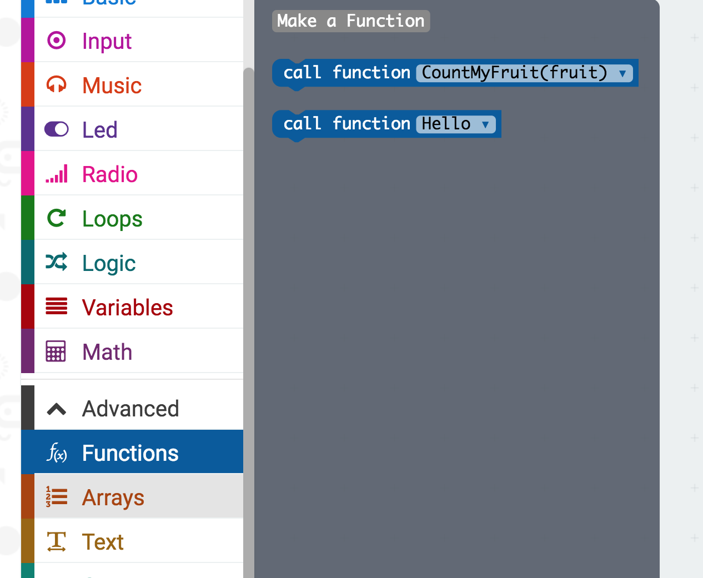
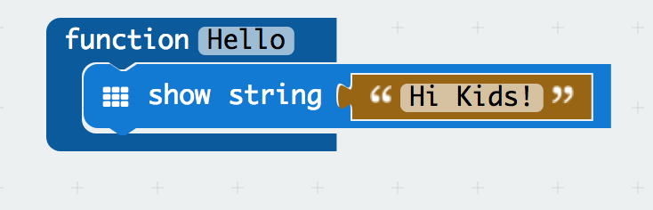
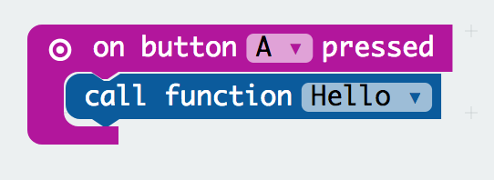
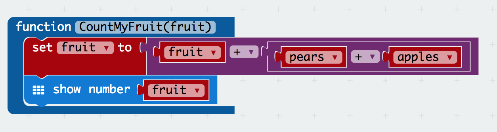
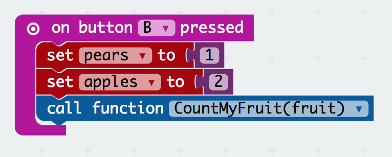
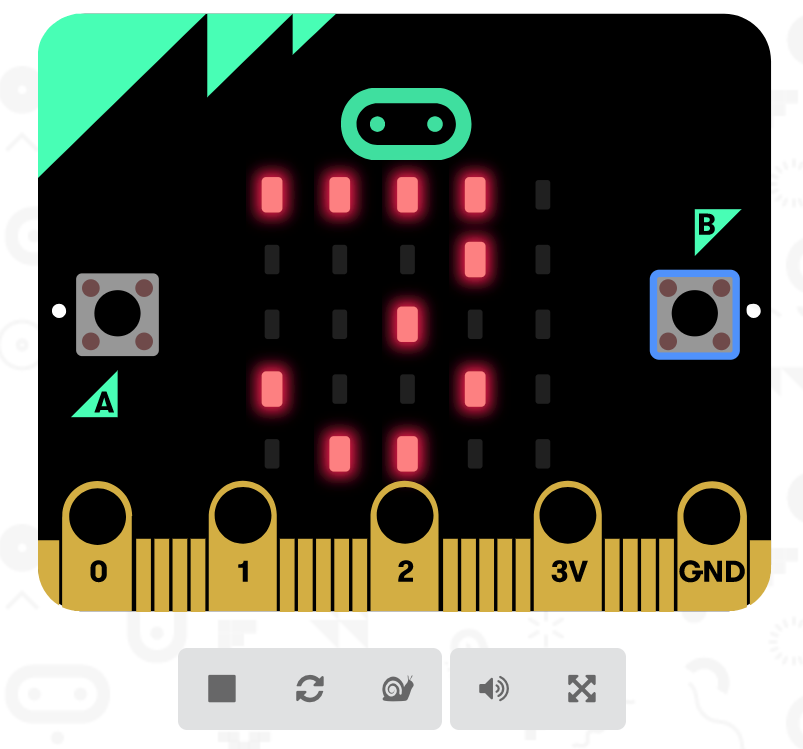
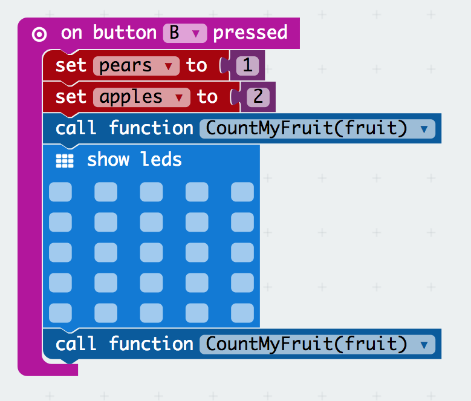
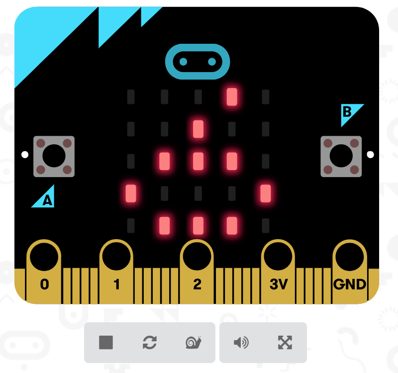
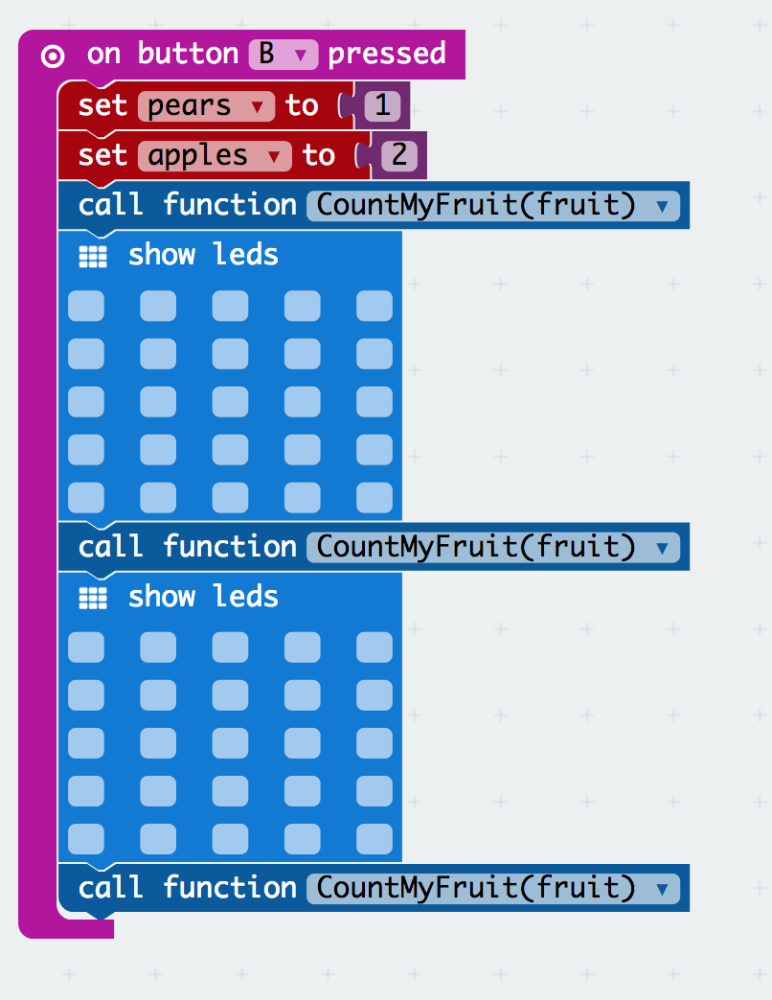
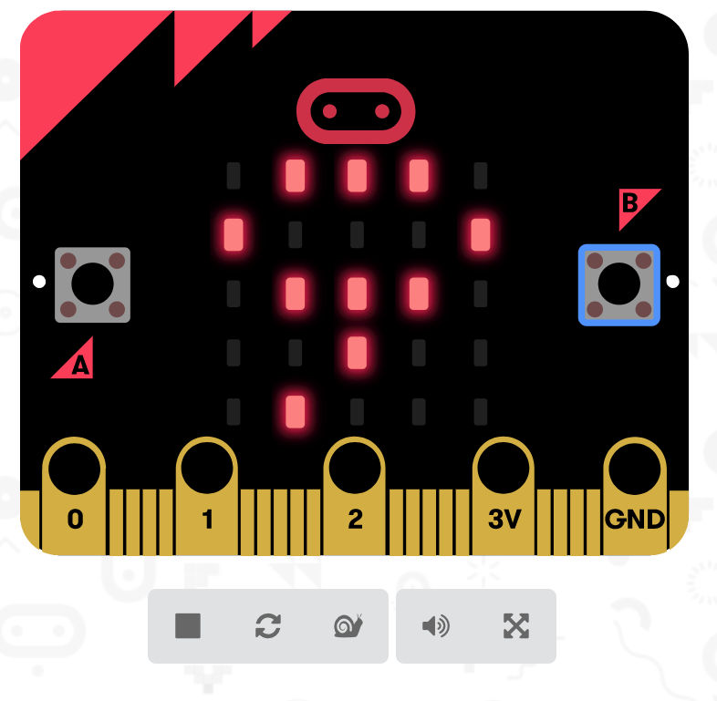

# Activity Worksheet: Functions
## Introduction
In this project activity you will learn how to create and use functions with micro:bit. You will learn why functions are useful, and how to use them together with your previous knowledge.
This time, please read the instructions carefully, as you will not be shown where the different blocks are lockated, but the instructions will tell you this information.

## Part 1: Basic Function
Lets begin the activity with an introductory function:

- [ ] Open up a browser and go **[https://makecode.microbit.org](https://makecode.microbit.org)**
- [ ] Start a new empty project by clicking on the **Project Menu** and select the **New Project** menu button in the pop-up screen, as you have done in previous lessons
- [ ] Go to **Advanced** and click on **Functions**
- [ ] Click on *Make a function* and here you give it the name *Hello*

    

- [ ] Our function will display a message, I have chosen "Hi Kids!" but you can choose whatever you would like
- [ ] To get the **show string** block go to Basic menu and drag it inside the function
- [ ] To get the **message** with the string go to Advanced then go to Text menu and drag the box with quotations

    

- [ ] To see anything, we now need to call our function
- [ ] From **Input** menu drag the On Button A pressed block
- [ ] Go to **Advanced** and from **Functions** drag the **Call function Hello** block as seen bellow

    

## Part 2: Function with and variables
In this part we introduce a new type of function: a function which makes use of a variable, and it will change the value of the variable each time it is called.

- [ ] Go to **Advanced** and from **Functions** create a new function, let's name it *CountMyFruit(fruit)*
- [ ] We calculate the total number of fruit by adding how many fruit we previously had with the total number of pears and apples, so each time we call this function our total number of fruit will increase
- [ ] Create variables: **fruit**, **apples** and **pears** as shown bellow, by clicking on *Make a variable*

    

- [ ] Drag the **set item** block and choose to set variable **fruit**
- [ ] From the **Math** menu go and drag the **0 + 0** block and attach it to **set item**
- [ ] Now put the variable **fruit** on the right hand side, and on the left drag another **0 + 0** block
- [ ] In the block on the left grag varaibles **pears** and **apples** as seen

    

- [ ] From the **basic menu** drag the **show number** block and replace the number with our varaible **fruit** such that it shows in the microbit
- [ ] We have now created our first complex function, leave this function here, as we will use it going furthr

## Part 3: Calling a complex function multiple times
In this part you will learn how to call a function multiple times, such that you do not need to repeat the complex operation. We will make use of operations that we have learned in previous classes.

- [ ] From the **Input** menu select the **on button B pressed** block and drag it to the workspace
- [ ] Now go to the variables menu and select the **set** item block twice, and for each set **pears** and **apples** variables respectively
- [ ] Set **pears** to 1 and set **apples** to 2
- [ ] Here we will call our function and see what happens: go to **Advanced** and then go to **Functions** and select the **call function CountMyFruit(fruit)** and drag it in the block with the other as seen

    

- [ ] Refresh the microbit and press Button **B**; what is displayed?

    

- [ ] number 3 is displayed, because the default value for our *fruit* variable is set to 0 and our function calcualtes the value of fruit + ( pears + apples ) which is equal to 0 + ( 1 + 2 ) = 3
- [ ] lets display a blank screen from the **Basic** menu
- [ ] now call the function again as you did before, this time what number is displayed?
- [ ] refresh the microbit before you run your code

    

    

- [ ] let's repeat this one more time, do you understand what is happening? Why is the number increasing by 3?

    

    

